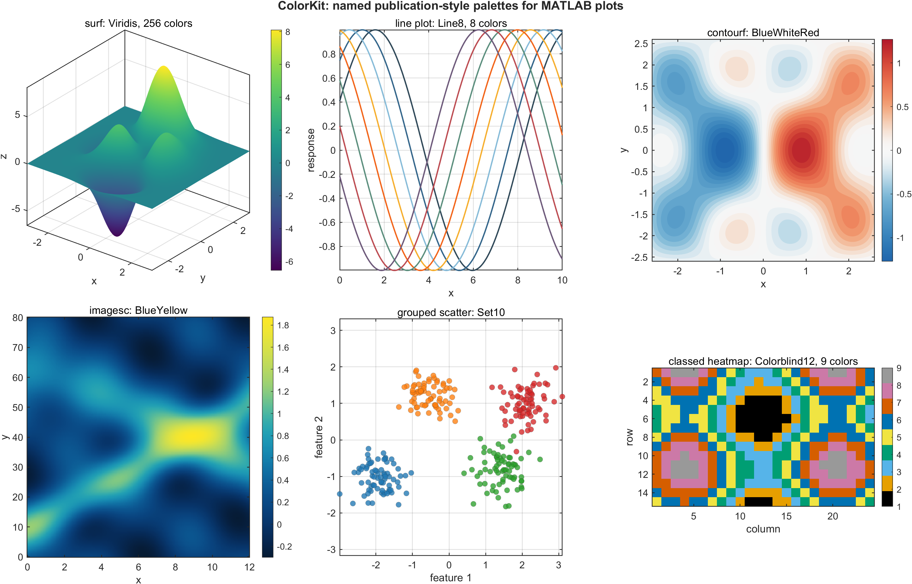
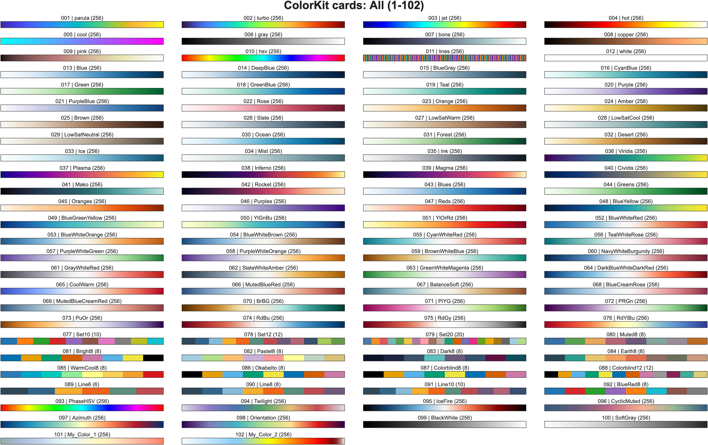
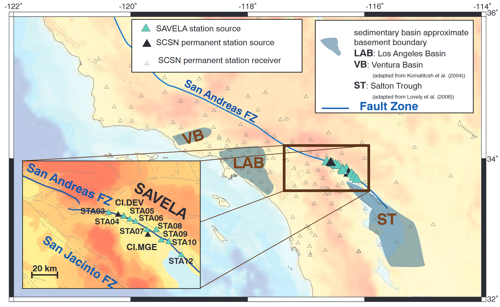
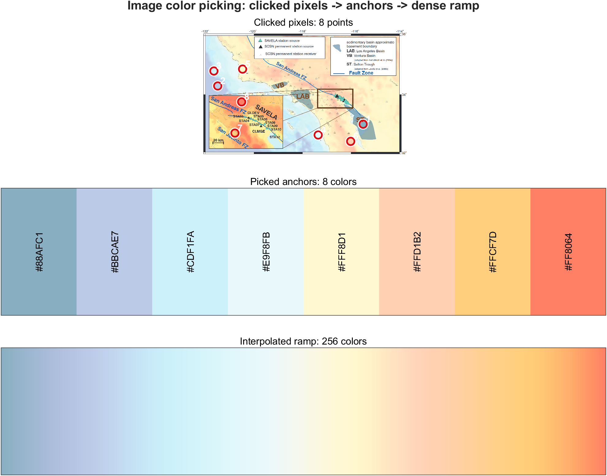
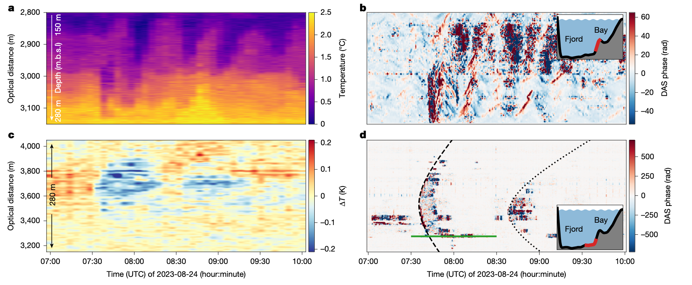
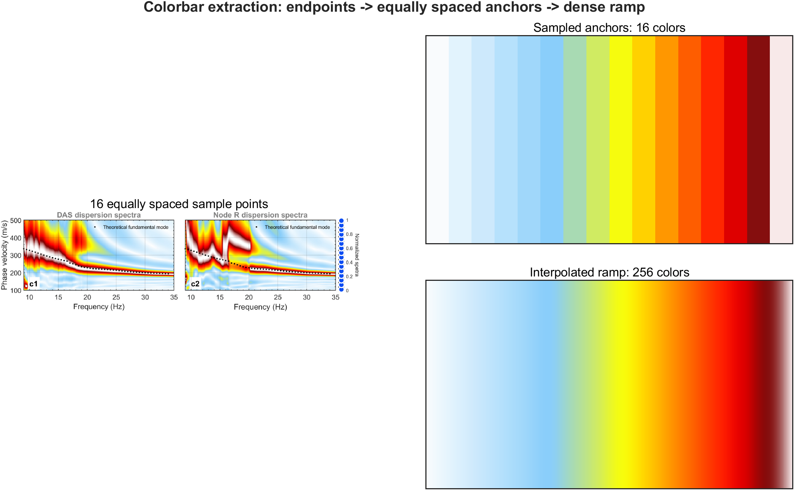
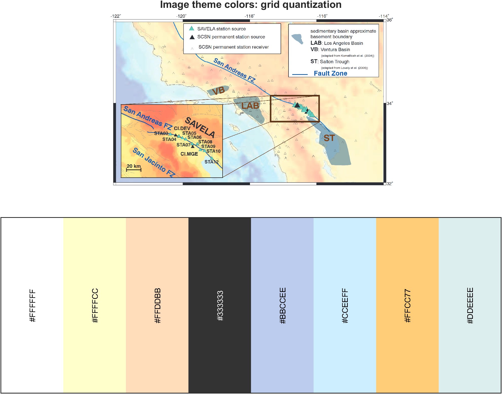
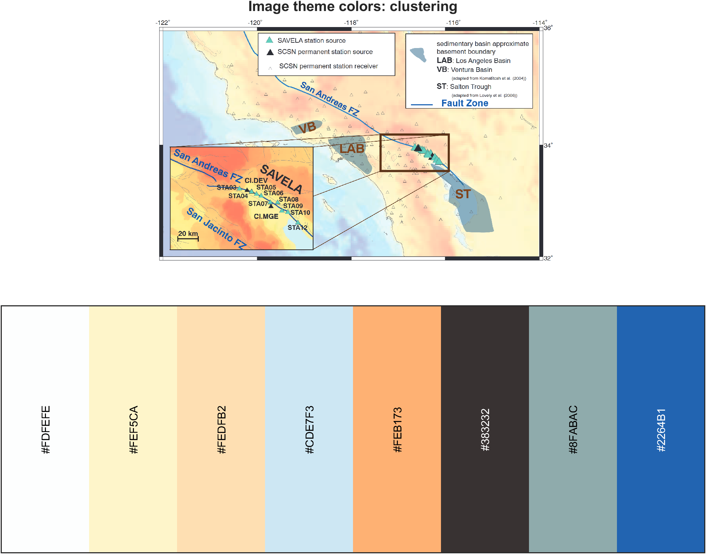
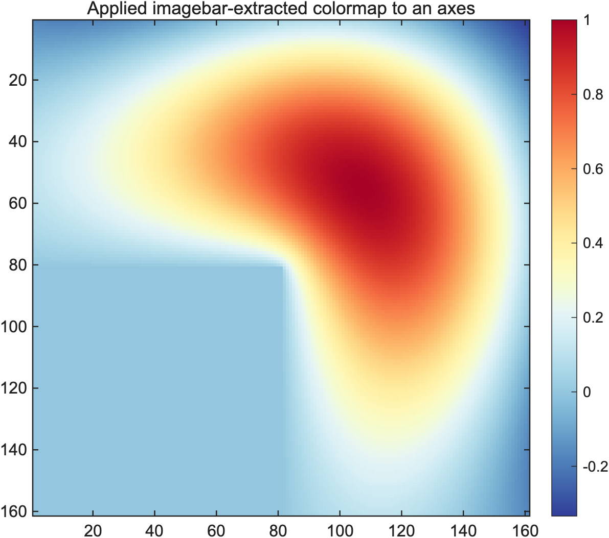

# ColorKit MATLAB 科研配色工具箱

[English](README.md) | [中文](README_CN.md)

作者：zhaoyh  
Email：zhao2025@mail.sustech.edu.cn

ColorKit 是一个面向 MATLAB 科研绘图的紧凑型 colormap / palette 工具箱。它包含约 80-100 套内置命名配色，并支持图片点击取色、截图 colorbar 恢复、图片主题色提取、色卡浏览、用户预设，以及交互式 `ColormapDesigner` GUI。

## 这个工具包能做什么

- 像色卡手册一样先浏览配色，再决定用于哪张图。
- 按名称或 catalog 编号调用 palette，并用于 `imagesc`、`surf`、`contourf`、多线图、散点图或分类热图。
- 从任意导入图片中点击取色，也可以传入固定像素坐标，方便脚本复现。
- 通过截图 colorbar 的首尾两点恢复 colormap。
- 用颜色网格量化或聚类两种方式提取图片主题色。
- 把任意 `N x 3` RGB 矩阵保存为用户预设。
- 随着使用经验积累，为配色补充个人 `RecommendedUse` 用途备注。
- 打开 `ColormapDesigner` 手动编辑、预览、调参、应用和导出 colormap。

## 图文导览

下面的图片由 `Demo_ColorKitFull.m` 生成，并存放在 `Figures/` 文件夹。

### 科研绘图示例

常见 MATLAB 绘图场景：三维曲面、分类多线图、发散场等值线、频谱风格图、分类散点图和分类热图。



### 色卡浏览

`cards` 用来生成类似 cheatsheet 的色卡浏览图。每张色卡标题都会显示 `ID | Name (colors)`，当名称不好记时，可以直接按编号调用。分类色可以使用原生颜色数；连续 colormap 可以用 `nColors = 256` 显示为平滑渐变，便于横向比较。



### 图片点击取色

下面这张图是图片工作流使用的示例源图。你可以用 `pick` 手动点击颜色，也可以用 `'points'` 指定固定像素坐标以便复现。



点击得到的颜色会返回为 `M x 3` RGB 矩阵。流程图会把采样像素标在源图上，同时显示采样到的锚点色和插值后的 256 色平滑渐变。



### 从图片恢复 Colorbar

如果一张截图里已经有 colorbar，只需要点击 colorbar 内部的首尾两点。ColorKit 会沿这条直线生成 `samples` 个等间隔采样点，再把这些锚点插值成致密 colormap。





### 图片主题色提取

`theme-grid` 和 `theme-cluster` 都用于概括图片主色，但方法不同。





### 应用提取出来的 Colormap

ColorKit 返回的任何配色本质上都是 `[0, 1]` 范围内的 `N x 3` double RGB 矩阵，可以直接传给 `colormap(ax, C)`。



## 文件说明

| 文件 | 用途 |
|---|---|
| `ColorKit.m` | 工具箱主入口、预设库、图片提取工具、色卡浏览和自检。 |
| `getPresetColormap.m` | 轻量包装函数：`cmap = getPresetColormap(nameOrID, n);` |
| `ColormapDesigner.m` | 交互式 GUI，用于编辑、预览、应用和导出 colormap。 |
| `Demo_ColorKitFull.m` | 主 demo 脚本。可逐节运行，体验工具箱主要功能。 |
| `ColorKit_UserPresets.m` | 用户通过 `ColorKit('add-preset', C, ...)` 添加的配色。 |
| `ColorKit_UserMetadata.m` | 用户通过 `ColorKit('set-use', ...)` 修改的用途备注。 |
| `Figures/` | README 和 demo 使用的图片。 |

## 快速开始

克隆或下载本仓库，在 MATLAB 中把项目文件夹设为当前文件夹，然后把工具箱加入 MATLAB 路径：

```matlab
addpath(genpath(pwd))
```

调用一个 256 色命名 colormap：

```matlab
C = ColorKit('palette', 'Blue', 'nColors', 256);
imagesc(peaks(200));
colormap(C);
colorbar;
title('Blue');
```

如果只想得到 colormap，也可以用轻量函数：

```matlab
C = getPresetColormap('Viridis', 256);
```

也可以用 catalog 编号调用。编号可以从 `ColorKit('catalog')` 表格或色卡标题中查看：

```matlab
catalogTable = ColorKit('catalog');
C = ColorKit('palette', 13, 'nColors', 256);
C = getPresetColormap(13, 256);
```

打开 GUI 编辑器：

```matlab
ColormapDesigner
```

运行完整 demo：

```matlab
Demo_ColorKitFull
```

## 基本调用方式

大多数调用都遵循这个模式：

```matlab
output = ColorKit(action, mainInput, options...)
```

示例：

```matlab
C = ColorKit('palette', 'Blue', 'nColors', 256);
C = ColorKit('palette', 13, 'nColors', 256);
C = ColorKit('ramp', 'BlueWhiteRed', 'nColors', 256);
C = ColorKit('pick', img, 'preview', true);
C = ColorKit('imagebar', img, 'samples', 16, 'nColors', 256);
C = ColorKit('theme-grid', 8, img);
row = ColorKit('add-preset', C, 'presetName', 'My_BlueOrange');
row = ColorKit('set-use', 'My_BlueOrange', 'phase display');
```

连续 colormap 输出为 `[0, 1]` 范围内的 `N x 3` double RGB 矩阵。分类配色同样返回 RGB 矩阵；当请求的颜色数超过原生锚点数时，工具箱会扩展颜色，避免所有颜色变成简单重复的一条平线。

## 主要功能

| 功能 | 示例 | 输出 | 含义 |
|---|---|---|---|
| `palette` | `ColorKit('palette','Blue','nColors',256)` 或 `ColorKit('palette',13,'nColors',256)` | `N x 3` RGB | 按名称或 catalog 编号读取配色。 |
| `ramp` | `ColorKit('ramp','BlueWhiteRed','nColors',256)` | `N x 3` RGB | `palette` 加指定长度的可读别名。 |
| `cards` | `ColorKit('cards','blue',1,40,'nColors',256)` | figure handle | 浏览配色色卡。 |
| `search` | `ColorKit('search','diverging')` | table | 按名称、PaletteGroup、类型、用途备注、sourceStyle 和用户自定义分组搜索。 |
| `catalog` | `ColorKit('catalog')` | table | 返回完整配色 metadata 表。 |
| `about` | `ColorKit('about')` | table | 汇总各 PaletteGroup 数量。 |
| `pick` | `ColorKit('pick', img, 'preview', true)` | `M x 3` 或 `N x 3` RGB | 从点击或固定像素中提取图片颜色。 |
| `imagebar` | `ColorKit('imagebar',img,'samples',16,'nColors',256)` | `N x 3` RGB | 从图片 colorbar 线上采样并致密化。 |
| `theme-grid` | `ColorKit('theme-grid',8,img)` | `k x 3` RGB | 通过颜色量化统计提取图片主色。 |
| `theme-cluster` | `ColorKit('theme-cluster',8,img)` | `k x 3` RGB | 通过 k-means 或内部 fallback 聚类提取图片主色。 |
| `add-preset` | `ColorKit('add-preset', C, 'presetName','My_BlueOrange')` | table row | 保存任意 `N x 3` RGB 矩阵为用户预设。 |
| `set-use` | `ColorKit('set-use','My_BlueOrange','phase display')` | table row | 修改某个配色的个人用途备注。 |

## 常用参数

| 参数 | 适用功能 | 含义 |
|---|---|---|
| `'nColors', N` | `palette`, `ramp`, `pick`, `imagebar`, `cards` | 请求输出颜色数。连续图常用 256；分类色常用 5-12；高质量图像导出可用 512 或 1024。 |
| `'preview', true/false` | palette 和图片工作流 | 是否显示预览图。批处理脚本中可设为 `false`。 |
| `'points', [x y; ...]` | `pick` | 固定图片像素坐标，使图片取色可复现。 |
| `'endpoints', [x1 y1; x2 y2]` | `imagebar` | 图片中 colorbar 线段的首尾点像素坐标。 |
| `'samples', N` | `imagebar` | 在两个 colorbar 端点之间等间隔采样的锚点数量。 |
| `'columns', n` | `cards` | 色卡浏览图的列数。代码内部会约束在实际可用范围内。 |
| `'visible', true/false` | `cards` | 是否显示色卡图窗。需要只导出图片时可设为 `false`。 |
| `'saveAs', file` | `cards` | 通过 `exportgraphics` 导出色卡图。 |
| `'presetName', name` | `add-preset` | 新用户预设名称。非法字符会被规范化。 |
| `'paletteGroup'` | `add-preset` | 推荐使用的用户配色分组。可以使用现有分组，也可以填写自己的新分组名；默认 `"none"` 会归入 `"Custom"`。 |
| `'type'` | `add-preset` | 可选配色类型：`sequential`、`diverging`、`cyclic`、`qualitative` 或 `"none"`。 |
| `'sourceStyle'` | `add-preset` | 可选来源或风格说明，默认 `"none"`。 |
| `'recommendedUse'` 或 `'use'` | `add-preset`, `set-use` | 个人用途备注。内置和用户新增配色默认都是 `"none"`。 |

## PaletteGroup 配色分组

GUI 使用一套很短的中性分组，让色卡浏览更容易扫读。用户新增 palette 也可以带自定义分组名；这些自定义分组会保留在 `ColorKit('catalog')` 中，也可以通过搜索找到，但 GUI 下拉菜单仍固定显示主分组。

| PaletteGroup | 含义 |
|---|---|
| `All` | 显示 catalog 中的全部配色。 |
| `Built-in` | MATLAB 内置和基础常用 colormap。 |
| `Sequential` | 单向连续变量。 |
| `Diverging` | 有中心值或正负变化的变量。 |
| `Categorical` | 分类数据，例如多条曲线、台站、事件类别或样品组。 |
| `Cyclic` | 相位、方位角、方向和周期变量。 |
| `Grayscale` | 灰度或近单色配色，适合黑白打印可读性检查。 |
| `Custom` | 未指定自定义分组时，用户新增配色的默认分组。 |

查看精确编号、名称和 metadata：

```matlab
catalogTable = ColorKit('catalog');
aboutTable = ColorKit('about');
```

搜索示例：

```matlab
ColorKit('search', 'blue')
ColorKit('search', 'diverging')
ColorKit('search', 'Custom')
ColorKit('search', 'MyGroup')
```

绘图前浏览色卡：

```matlab
ColorKit('cards', 'All', 1, 40, 'columns', 4);
ColorKit('cards', 'Sequential', 1, 40, ...
    'nColors', 256, 'columns', 4);
ColorKit('cards', 'blue', 1, 40, ...
    'nColors', 256, 'columns', 4);
```

色卡标题格式为 `ID | Name (colors)`。例如某张色卡显示 `013 | Blue (256)`，下面两种写法会返回同一套配色：

```matlab
C1 = ColorKit('palette', 'Blue', 'nColors', 256);
C2 = ColorKit('palette', 13, 'nColors', 256);
```

## 如何选择配色类型

`sequential` 适合单向连续变量，例如振幅、能量、密度、概率、强度、RMS、PSD 或其它非负场。

`diverging` 适合有中心值的变量，例如正负场、差值、残差、异常值、扰动场、围绕 0 的相关性或平衡对比。

`cyclic` 适合周期变量，例如相位、角度、方位角、方向或首尾需要相接的包裹变量。

`qualitative` 适合分类变量，例如不同组别、类别、台站、事件、曲线系列、标注或标签。

不建议把 `jet` 或 rainbow-like 配色作为定量连续数据的默认 colormap。它们容易产生视觉伪边界，在灰度打印中也不稳定。工具箱保留它们主要用于 MATLAB 兼容和对照。

## 推荐绘图工作流

建议把 palette 名称作为脚本顶部变量。这样图标题、colormap 调用和导出说明都会自动同步：

```matlab
mapSurface = "Viridis";
mapLine = "Line8";
mapDiverging = "BlueWhiteRed";
nContinuous = 256;

C_surface = ColorKit('palette', mapSurface, 'nColors', nContinuous);
surf(peaks(120), 'EdgeColor', 'none');
colormap(C_surface);
colorbar;
title(sprintf("surf: %s, %d colors", mapSurface, nContinuous), ...
    'Interpreter', 'none');
```

`Demo_ColorKitFull.m` 使用的就是这种写法。

## 图片点击取色

当你想从照片、论文图、地图或设计参考中选取具体颜色时，使用 `pick`。

交互式取色：

```matlab
[fileName, folderName] = uigetfile( ...
    {'*.png;*.jpg;*.jpeg;*.tif;*.tiff;*.bmp', 'Image files'; '*.*', 'All files'}, ...
    'Import an image for color picking');

img = imread(fullfile(folderName, fileName));
[C, info] = ColorKit('pick', img, 'preview', true);
```

在图片中点击多个颜色，然后按 Enter。输出 `C` 为 `M x 3` RGB 矩阵。第二个输出 `info` 中包含 `info.Points`，记录了鼠标点击的像素坐标，便于把流程写进文档或复现实验。

可复现取色：

```matlab
points = info.Points;
C = ColorKit('pick', img, 'points', points, 'preview', true);
```

把取到的锚点颜色插值成平滑渐变：

```matlab
C256 = ColorKit('pick', img, ...
    'points', points, ...
    'nColors', 256, ...
    'preview', true);
```

满意后再保存为用户预设：

```matlab
row = ColorKit('add-preset', C256, ...
    'presetName', 'My_ImageRamp_1', ...
    'paletteGroup', 'Custom', ...
    'type', 'none', ...
    'sourceStyle', 'none');
```

## 图片主题色提取

主题色提取用于概括图片中的主要颜色，适合制作分类色、海报配色、PPT 主题色或与已有图件风格一致的配色。

```matlab
img = imread(fullfile('Figures', 'fig1_color_pick_source.png'));

C_grid = ColorKit('theme-grid', 8, img, 'preview', true);
C_cluster = ColorKit('theme-cluster', 8, img, 'preview', true);
```

`theme-grid` 会把 RGB 值量化到颜色网格中，再按照颜色出现频率排序。它速度快、结果确定、容易复现。缺点是可能过度偏向大面积背景、白边、黑色文字或重复标注色。

`theme-cluster` 会把相近颜色聚成若干类，再返回代表色。它通常更适合渐变、纹理和噪声较多的图片。缺点是如果某个强调色面积很小，可能被聚类过程平滑掉。

如果你需要速度和严格复现，优先用 `theme-grid`；如果你想概括复杂图片的整体视觉色彩，优先用 `theme-cluster`。

## 图片 Colorbar 提取

当一张截图中已经有你想复现的 colorbar 时，使用 `imagebar`。

交互式用法：

```matlab
[fileName, folderName] = uigetfile( ...
    {'*.png;*.jpg;*.jpeg;*.tif;*.tiff;*.bmp', 'Image files'; '*.*', 'All files'}, ...
    'Import an image that contains a colorbar');

img = imread(fullfile(folderName, fileName));
C = ColorKit('imagebar', img, ...
    'samples', 16, ...
    'nColors', 256, ...
    'preview', true);
```

点击 colorbar 内部的首尾两点。ColorKit 会在这两个点之间的直线上生成等间隔采样点。

可复现用法：

```matlab
endpoints = [x1 y1; x2 y2];
C = ColorKit('imagebar', img, ...
    'samples', 16, ...
    'endpoints', endpoints, ...
    'nColors', 256, ...
    'preview', true);
```

对仓库内置的 colorbar 示例：

```matlab
img = imread(fullfile('Figures', 'fig2_colorbar_source.png'));
endpoints = [1756 56; 1756 390];

C_anchor = ColorKit('imagebar', img, ...
    'samples', 16, ...
    'endpoints', endpoints, ...
    'preview', true);

C256 = ColorKit('imagebar', img, ...
    'samples', 16, ...
    'endpoints', endpoints, ...
    'nColors', 256, ...
    'preview', true);
```

`samples = 16` 表示在两个端点之间等间隔采样 16 个锚点颜色。如果原 colorbar 是分段的、彩虹色的，或者局部颜色变化很快，可以增大到 32 或更多；如果原 colorbar 很平滑，10-16 个锚点通常够用。

## 插值算法说明

图片取色和图片 colorbar 提取的流程是：

1. 从图片像素中采样锚点颜色。
2. 对 colorbar 来说，采样坐标由两个点击端点之间的 `linspace` 生成。
3. 像素颜色通过双线性插值读取，因此坐标不必刚好落在整数像素中心。
4. 锚点颜色用 MATLAB `interp1(..., 'pchip')` 重采样到请求的 `nColors`。
5. 最终 RGB 值裁剪到 `[0, 1]`。

`pchip` 是保形三次插值。它比线性 RGB 插值更平滑，同时通常比 spline 更不容易产生明显过冲。对于恢复截图中的 colorbar，这个默认选择很实用，因为截图本身已经是 RGB 编码。

限制也很明确：这里是 RGB 空间插值，不是严格的感知均匀色彩空间。如果你是从零设计新的科学 colormap，建议先从精简内置配色出发，再在 `ColormapDesigner` 中微调。

## 添加自己的预设

`add-preset` 与 `pick` 是独立的。任何好看的 `N x 3` RGB 矩阵都可以保存：

```matlab
C = ColorKit('palette', 'BlueCreamRose', 'nColors', 256);

row = ColorKit('add-preset', C, ...
    'presetName', 'My_BurgundyTeal', ...
    'paletteGroup', 'Custom', ...
    'type', 'none', ...
    'sourceStyle', 'none');
```

新预设会写入 `ColorKit_UserPresets.m`，并出现在 `ColorKit('catalog')` 的末尾。

之后可以像内置配色一样调用：

```matlab
C = getPresetColormap('My_BurgundyTeal', 256);
```

## 修改 RecommendedUse

所有配色的 `RecommendedUse` 默认都是 `"none"`。这样你可以在实际使用中发现某个配色适合某类图时，再把用途备注写进去。

```matlab
row = ColorKit('set-use', 'My_BurgundyTeal', 'frequency dispersion map');

catalog = ColorKit('catalog');
catalog(strcmp(catalog.Name, 'My_BurgundyTeal'), :)
```

更新会写入 `ColorKit_UserMetadata.m`。恢复为默认值：

```matlab
ColorKit('set-use', 'My_BurgundyTeal', 'none');
```

catalog 表字段含义：

- `ID`：当前 catalog 顺序，可以直接调用，例如 `ColorKit('palette', 13, 'nColors', 256)`。
- `Name`：稳定配色名称，用于 `ColorKit('palette', name, ...)`。
- `PaletteGroup`：GUI 和 catalog 中显示的中性浏览分组。
- `Type`：配色行为，常见为 `sequential`、`diverging`、`cyclic`、`qualitative` 或 `none`。
- `Colors`：自定义配色的锚点数量，或 MATLAB 内置配色的原生长度。
- `RecommendedUse`：你的个人用途备注，默认 `none`。
- `SourceStyle`：可选风格或来源标签。

## ColormapDesigner GUI

打开：

```matlab
ColormapDesigner
```

GUI 支持：

- 按 PaletteGroup 分组筛选和关键词搜索
- 与配色库联动的 Palette 下拉框
- 控制点编辑：`position`、`R`、`G`、`B`、`Hex`
- 增加和删除颜色节点
- 自动按 position 排序，并把 RGB 裁剪到合法范围
- 插值方式：`linear RGB`、`pchip RGB`、`spline RGB`、`perceptual-like`
- colormap 长度选择：64、128、256、512、1024
- reverse、gamma、brightness、contrast、saturation、truncate
- diverging colormap 的中心颜色锁定
- colorbar、标量场、发散场、分类线、灰度、矩阵纹理等预览
- 导出到 workspace、MAT、TXT/CSV、MATLAB 函数、剪贴板代码和预览图
- 把当前 colormap 应用到已有 figure 或 axes

参数含义：

- `Gamma`：重新分配 colormap 上的明暗对比。大于 1 会强调一端，小于 1 会强调另一端。
- `Brightness`：在 RGB 空间整体增亮或变暗。
- `Contrast`：拉伸或压缩颜色相对中灰的距离。
- `Saturation`：提高或降低色彩饱和度。
- `Truncate start/end`：截取 colormap 的一段，再重采样回 `N` 个颜色。
- `Center color locking`：把发散型 colormap 的中心位置拉向白色或浅灰色。

## 验证

核心自检：

```matlab
ColorKit('__selftest__')
ColormapDesigner('__selftest__')
```

静态代码检查：

```matlab
checkcode('ColorKit.m', ...
    'ColorKit_UserPresets.m', ...
    'ColorKit_UserMetadata.m', ...
    'getPresetColormap.m', ...
    'ColormapDesigner.m', ...
    'Demo_ColorKitFull.m')
```

## 备注

- 用户新增配色单独存放在 `ColorKit_UserPresets.m`。
- 用户 metadata 覆盖项存放在 `ColorKit_UserMetadata.m`。
- 内置 palette 使用中性的颜色属性命名；用户新增 palette 可以自由设置名称和 `paletteGroup`。
- `ramp` 不是一套单独的配色库，只是“按指定长度获取某个命名配色”的可读别名。

## 许可证

本项目基于 [MIT License](LICENSE) 开源发布。
